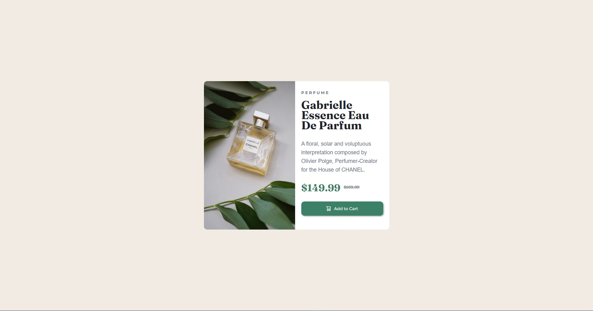

# Frontend Mentor - Product preview card component solution

This is a solution to the [Product preview card component challenge on Frontend Mentor](https://www.frontendmentor.io/challenges/product-preview-card-component-GO7UmttRfa). Frontend Mentor challenges help you improve your coding skills by building realistic projects. 

## Table of contents

- [Overview](#overview)
  - [The challenge](#the-challenge)
  - [Screenshot](#screenshot)
  - [Links](#links)
- [My process](#my-process)
  - [Built with](#built-with)
  - [What I learned](#what-i-learned)
  - [Continued development](#continued-development)
- [Author](#author)

## Overview

### The challenge

Users should be able to:

- View the optimal layout depending on their device's screen size
- See hover and focus states for interactive elements

### Screenshot

  

### Links

- Solution URL: [Repository](https://github.com/AdhemarRomero/product-preview-card-component-main)
- Live Site URL: [Deploy](https://adhemarromero.github.io/product-preview-card-component-main/)

## My process

### Built with

- Semantic HTML5 markup
- CSS custom properties
- Flexbox
- Mobile-first workflow

### What I learned

In this project I reinforced that knowledge acquired in a self-taught way.

### Continued development

Just as I've learned things, I know I don't have clean code yet. So I will keep practicing to improve.

Any comments on this or other projects would be very helpful.

## Author

- LinkedIn - [Adhemar Romero](https://www.linkedin.com/in/adhemar-alessandro-romero-urbina/)
- Frontend Mentor - [@AdhemarRomero](https://www.frontendmentor.io/profile/AdhemarRomero)
- GitHub - [AdhemarRomero](https://github.com/AdhemarRomero)
